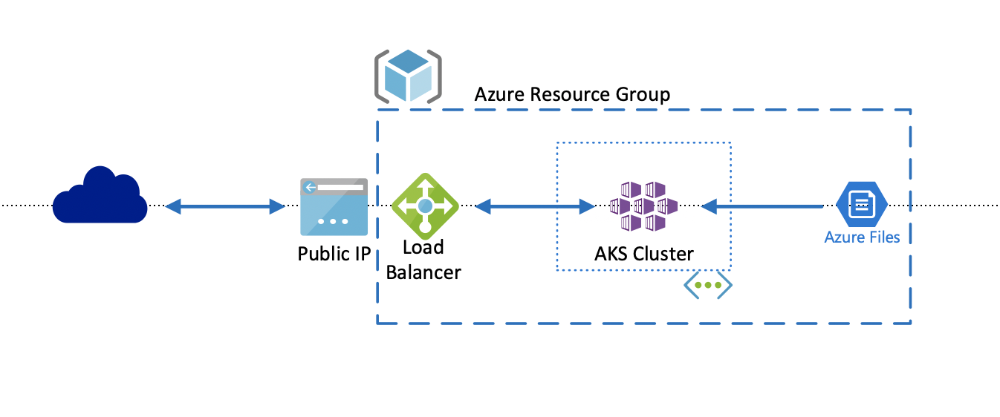
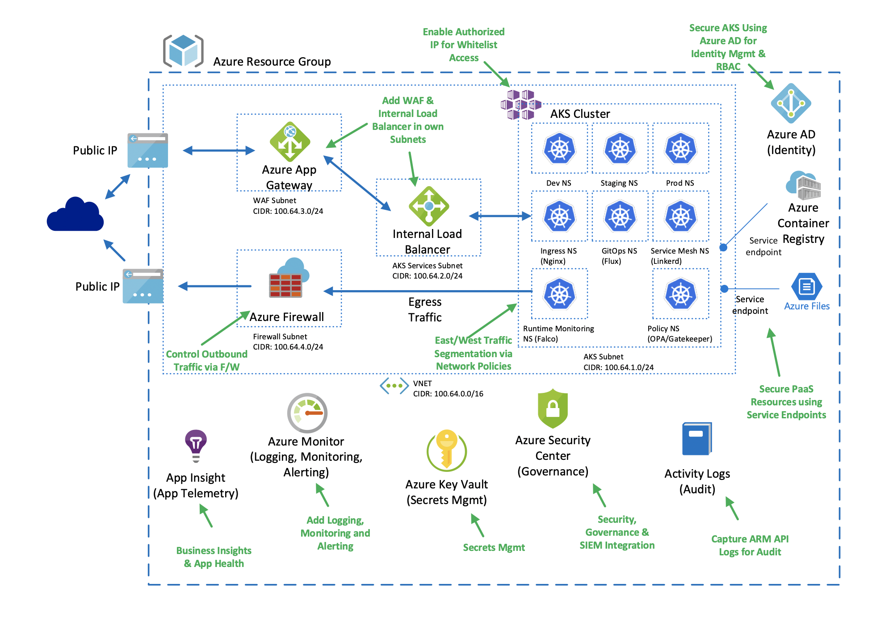

# WORK IN PROGRESS

This repo is a **WORK IN PROGRESS**.

# Cloud Native App Governance + Security Workshop

Hello, and welcome to the workshop. This is a 2-day hands-on workshop focused on setting up AKS along with additional technologies to make it adhere to the governance and security needs of highly regulated customers.

The workshop runs over 2 days and is meant to take an outside in approach. Meaning, we will start from the outside of the architecture and make our way inwards. It starts with focusing on Governance and Security decisions that need to be made before a single Azure resource is provisioned. We will then focus on decisions that need to get made prior to provisioning the cluster. Next, we will provision the cluster along with focusing on how to deploy common components post-provisioning. Once the cluster is configured, the next steps are to actually deploy workloads. Finally when the workloads are deployed, we will focus in on Day 2 operations when it comes to managing, maintaining and provising observability into the cluster.

## End Goal

The end goal is to take you from having a kubernetes setup that is unsecure by default, to an Enterprise ready configuration that is secure by default. To help understand what that means please see the following illustrations showing a before and after setup.

### Before Picture

### After Picture

## Lab Guides - Day 1

  1. [Customer Scenario](customer-scenario/README.md)
  2. [Security, Governance & Azure Security Setup](governance-security/README.md)
  3. [Cluster Design](cluster-design/README.md)
  4. [Cluster Pre-Provisioning](cluster-pre-provisioning/README.md)
  5. [Cluster Provisioning](cluster-provisioning/README.md)
  6. [Post-Provisioning](post-provisioning/README.md)
  7. [Cost Governance](cost-governance/README.md)
  8. [Deploy App](deploy-app/README.md)

## Lab Guides - Day 2

  1. [Deploy App](deploy-app/README.md)
  2. [Day 2 Operations](day2-operations/README.md)
  3. [Service Mesh - Do I need it?](service-mesh/README.md)
  4. [Validate Scenarios](validate-scenarios/README.md)
  5. [Thought Leadership](thought-leadership/README.md)

## Prerequisites

The following are the requirements to **start**.

- Azure Account | [Azure Portal](https://portal.azure.com)

  - Ability to create AKS Clusters
  - Ability to create Azure Service Principals or access to one that can create AKS Clusters

- Azure CLI | [Install CLI](https://docs.microsoft.com/en-us/cli/azure/install-azure-cli?view=azure-cli-latest)

  - Minimum Version: 2.0.80
  - AKS Preview Extension: 0.4.27
  - Firewall Extension Version: 0.1.8

- Kubectl CLI | [Install kubectl with Azure CLI](https://docs.microsoft.com/en-us/azure/aks/kubernetes-walkthrough#connect-to-the-cluster)

  - Minimum Version: 1.15.0

- Git | [Git SCM](https://git-scm.com/downloads)

  - Minimum Version: 2.22

- GitHub Account | [GitHub Account](https://help.github.com/en/github/getting-started-with-github/signing-up-for-a-new-github-account)

  - Required for GitOps Approach to Multi-Cluster Management

- Terraform | [Terraform Download](https://www.terraform.io/downloads.html)

  - Minimum Version: v0.12.20

- Docker Community Edition (CE) | [Install CE](https://docs.docker.com/v17.09/engine/installation/)

  - [Install Docker for Mac](https://docs.docker.com/v17.09/docker-for-mac/install/)
  - [Install Docker for Windows](https://docs.docker.com/v17.09/docker-for-windows/install/)

- Code Editor | [Install VS Code](https://code.visualstudio.com/download)

## Fork the Repo

**It is important to Fork this repo, not just clone it. You will be creating Personal Access Tokens, which in turn will be creating SSH keys, and they will be used to make changes to a GitHub repo.**

[Forking a Repository](https://help.github.com/en/github/getting-started-with-github/fork-a-repo)
  
# Contributing

This project welcomes contributions and suggestions.  Most contributions require you to agree to a
Contributor License Agreement (CLA) declaring that you have the right to, and actually do, grant us
the rights to use your contribution. For details, visit [https://cla.opensource.microsoft.com](https://cla.opensource.microsoft.com).

When you submit a pull request, a CLA bot will automatically determine whether you need to provide
a CLA and decorate the PR appropriately (e.g., status check, comment). Simply follow the instructions
provided by the bot. You will only need to do this once across all repos using our CLA.

This project has adopted the [Microsoft Open Source Code of Conduct](https://opensource.microsoft.com/codeofconduct/).
For more information see the [Code of Conduct FAQ](https://opensource.microsoft.com/codeofconduct/faq/) or
contact [opencode@microsoft.com](mailto:opencode@microsoft.com) with any additional questions or comments.

# Legal Notices

Microsoft and any contributors grant you a license to the Microsoft documentation and other content
in this repository under the [Creative Commons Attribution 4.0 International Public License](https://creativecommons.org/licenses/by/4.0/legalcode),
see the [LICENSE](LICENSE) file, and grant you a license to any code in the repository under the [MIT License](https://opensource.org/licenses/MIT), see the
[LICENSE-CODE](LICENSE-CODE) file.

Microsoft, Windows, Microsoft Azure and/or other Microsoft products and services referenced in the documentation
may be either trademarks or registered trademarks of Microsoft in the United States and/or other countries.
The licenses for this project do not grant you rights to use any Microsoft names, logos, or trademarks.
Microsoft's general trademark guidelines can be found at [http://go.microsoft.com/fwlink/?LinkID=254653](http://go.microsoft.com/fwlink/?LinkID=254653).

Privacy information can be found at [https://privacy.microsoft.com/en-us/](https://privacy.microsoft.com/en-us/)

Microsoft and any contributors reserve all other rights, whether under their respective copyrights, patents,
or trademarks, whether by implication, estoppel or otherwise.
