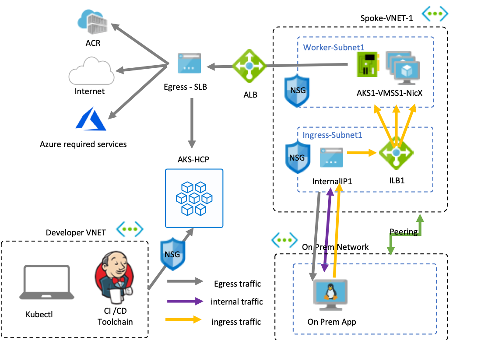
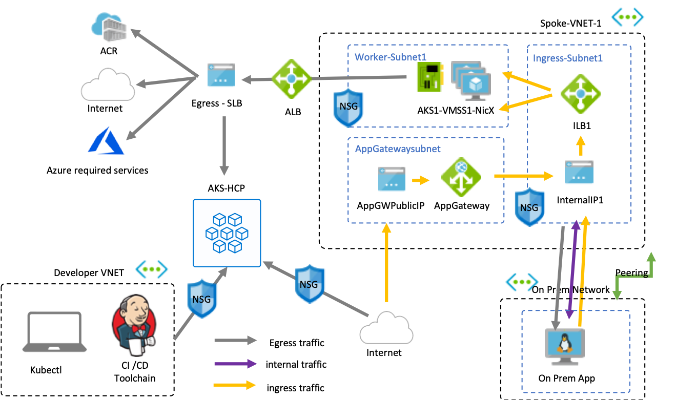
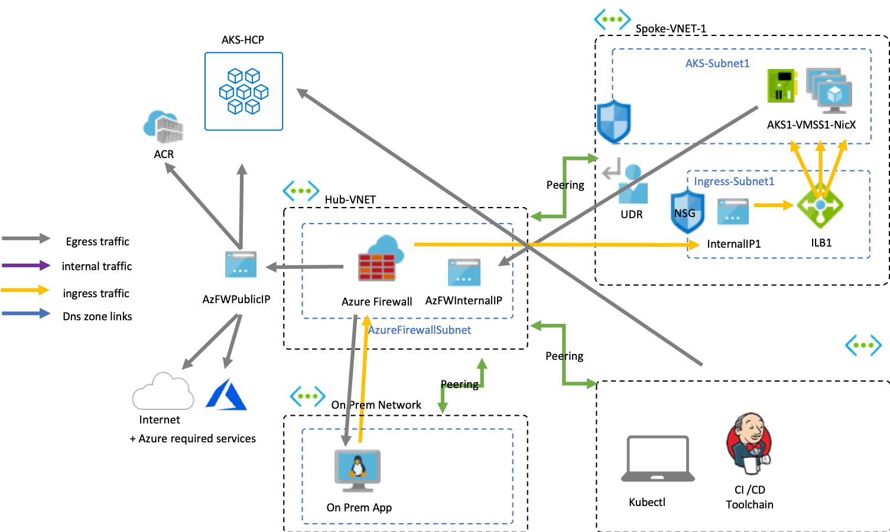
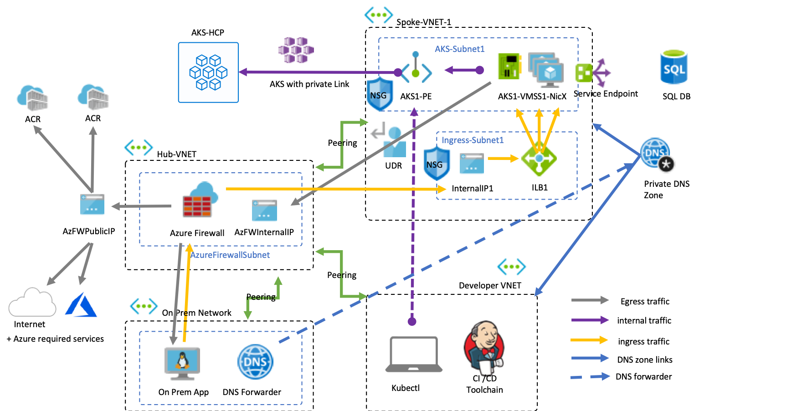
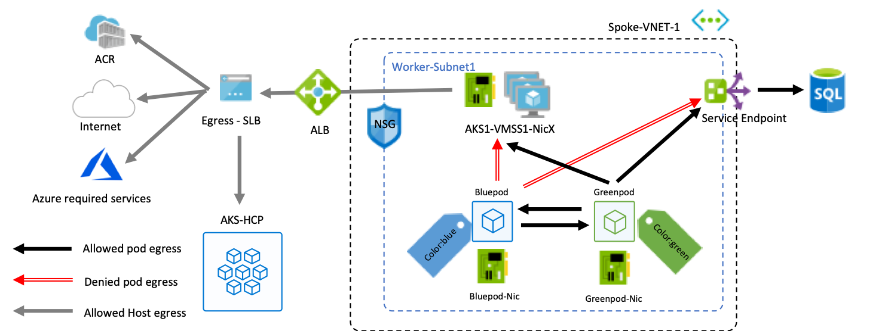

# Secure Network Design for AKS cluster

There are different design decisions and tradeoffs that need to be evaluated for coming up with an appropriate network topology. The following sections should allow you to make decisions based on given assumptions to come up with an architecture that is combinable with other topics.

## What is your subnet topology ?

Objective:

- Decide on the number of VNETs, subnets, IP ranges and NSGs and their configuration.
- Decide on ingress and egress routes and IP addresses

Assumptions:

- We have internal peered networks that are not trustworthy
- We can accept public IP addresses

The key design decisions for network topology are the following:

- How to prevent undesired access to the AKS API Server through the internet
- How to prevent SSH access to worker nodes from other internal networks
- How to define an internal ingress path to applications inside the cluster
- How to define an explicit egress path for worker nodes to the internet

Technologies used:

- Azure VNET
- Azure NSG
- AKS API Server Authorized IP Ranges
- Azure Standard Load Balancer Outbound rules

## Do you want to lock down ingress traffic ?

Objectives:

- Decide on the path of incoming traffic
- Decide on if and how you want to encrypt incoming traffic
- Decide if an azure managed service should be used for ingress

Assumptions:

- We have internal peered networks that are not trustworthy
- We have no requirements for filtering egress traffic
- We want to terminate SSL on the application gateway

Technologies used:

- Azure Application Gateway

## Do you want to lock down egress traffic ?

Objective:

- Decide on the need for filtering egress traffic
- Decide on the required egress communication paths
- Decide on the  firewall technology

Assumptions:

- We want all egress traffic from host and pods to be subject to application and network level filtering
- We have a process for maintaining the list of external dependencies

For deploying a fully private cluster the following design decisions have to be made:

- How to ensure the reachability of required azure services from the Kubernetes infrastructure
- How to force and filter all egress traffic through a firewall appliance
- How to expose services internally

Technologies used:

- Azure Firewall or third-party NVA
- User Defined Routes
- Azure NSG

## Do you want to build a fully private infrastructure?

Objective:

- Do you want to control all control plane communications
- Do you want to avoid internet-facing exposure

Assumptions:

- We do not want direct internet egress access for containerized applications
- We have on-prem resources that should communicate with the containerized apps through a private network
- We do not want to expose applications or control plane traffic to the internet

For deploying a fully private cluster the following design decisions have to be made:

- How to ensure the reachability of required azure services from the Kubernetes infrastructure
- How to force and filter all egress traffic through a firewall appliance
- How to ensure resolutions of private services through DNS
- How to ensure the access of the control plane by the CI/CD components

Technologies used:

- Azure firewall
- Azure private DNS Zone
- User Defined Routes

For more detailed documentation on how to set it up see here: [https://docs.microsoft.com/en-gb/azure/aks/private-clusters](https://docs.microsoft.com/en-gb/azure/aks/private-clusters)

## Do you want to isolate multiple internal workloads against each other ?

Objective:

- How to prevent internal workloads from reaching internal or internet endpoints

Assumption:

- We are running multiple workloads in the same cluster and want to isolate them
- We want to control which pods can communicate inside the cluster
- We want to control which pods can communicate with which external azure services
- We do not want to block the host but the pods based on their labels

For deploying isolated pods the following design decisions have to be made:

- How do we want to define the network policy rules for internal communication between pods
- How do we want to define the network policy for layer 7 rules to targets outside of the cluster

Technologies used:

- Calico Network policies
- Cillium Network policies

## Next Steps

[Cluster Design](/cluster-design/README.md)

## Key Links

- [Azure CNI](https://docs.microsoft.com/en-us/azure/aks/configure-azure-cni)
- [Kubenet](https://docs.microsoft.com/en-us/azure/aks/configure-kubenet)
