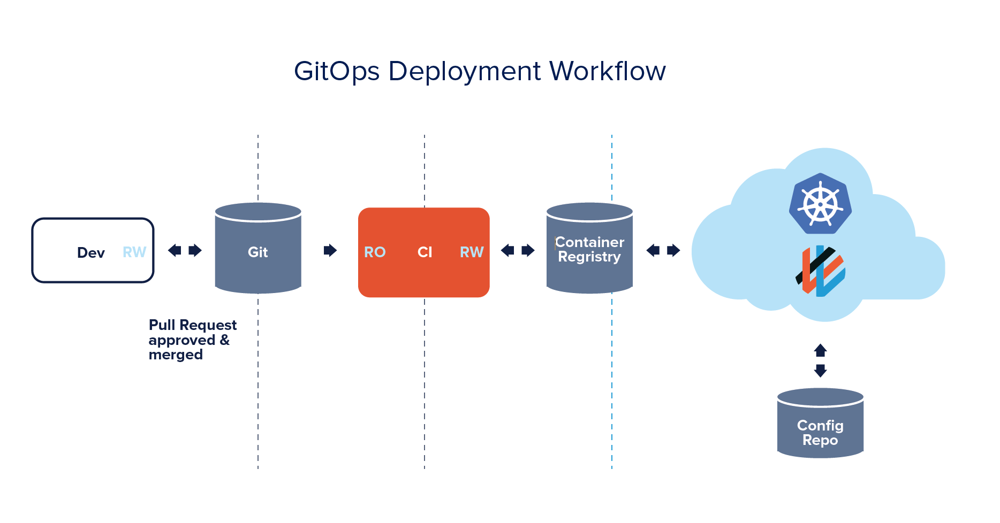
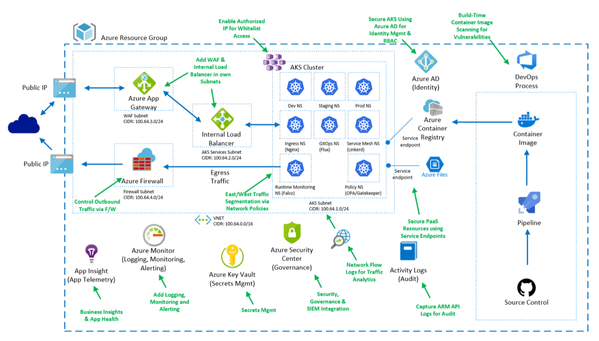

# Cluster Provisioning

This lab walks your through provisioning a secure AKS cluster utilizing Terraform. We will use Terraform to deploy the cluster and Weaveworks Flux to provide some post provisioning of resources, so we we can automate the entire provisioning and post-provisioning needed to have a production cluster.

You may ask "Why not utilize Azure Resource Manger Templates?"... The reason we have utilized Terraform is that it gives a multi-platform provisioning tool, that also lets us automate the provisioning of non-Azure resources, so we'll have a full production cluster setup from a single provisioning tool.

Why use a GitOps approach? Adopting GitOps in your CI/CD pipelines increases the security of your application and systems. With GitOps, a reconciliation operator is installed to the cluster itself that acts on a configuration repo that uses with separate credentials. The operator reconciles the desired state as expressed in the manifest files, stored in the git repo, against the actual state of the cluster. This means that credentials and other secrets don’t ever leave the cluster. This means that continuous integration operates independently rather than on the cluster directly and that each pipeline component needs only a single read-write credential. Since cluster credentials never leave the cluster, your secrets are kept close. -WeaveWorks

Pull Requests enabled on the config repo are independent of the cluster itself can be reviewed by developers. This leaves a complete audit trail of every tag update and config change, regardless of whether it was made manually or automatically. Although using git as part of your CICD pipeline adds another layer of defense, it also means that the security onus is shifted to git itself.

Weaveworks Flux was one of the first tools to enable the GitOps approach, and it’s the
tool we will use due to it's maturity and level of adoption. Below is a diagram that describes how the approach works.



We will first need to setup all our variables from the last lab, so we can utilize the networking infrastructure that was setup.

```bash
export TF_VAR_prefix=$PREFIX
export TF_VAR_resource_group=$RG
export TF_VAR_location=$LOC
export TF_VAR_client_id=$APPID
export TF_VAR_client_secret=$PASSWORD
export TF_VAR_github_organization=Azure
export TF_VAR_github_token=<ask_instructor>
export TF_VAR_azure_subnet_id=$(az network vnet subnet show -g $RG --vnet-name $VNET_NAME --name $AKSSUBNET_NAME --query id -o tsv)
export TF_VAR_aad_server_app_id=<ask_instructor>
export TF_VAR_aad_server_app_secret=<ask_instructor>
export TF_VAR_aad_client_app_id=<ask_instructor>
export TF_VAR_aad_tenant_id=<ask_instructor>
```

Now that we have all of our variables stored we can initialize Terraform.

First ensure you are in the Terraform directory

```bash
cd cluster-provisioning/terraform
```

Now initialize Terraform with the following command:

```bash
terraform init
```

This command is used to initialize a working directory containing Terraform configuration files. This is the first command that should be run after writing a new Terraform configuration or cloning an existing one from version control. It is safe to run this command multiple times.

Now that we have initialized our terraform directory, we will want to run a `terraform plan`. The `terraform plan` command is a convenient way to check whether the execution plan for a set of changes matches your expectations without making any changes to real resources or to the state. For example, terraform plan might be run before committing a change to version control, to create confidence that it will behave as expected.

```bash
terraform plan
```

After running this command you'll see output like the following that will show what is going to be provisioned.

```bash
add example output
```

Now that we have verified what will be deployed we can execute the `terraform apply` command, which will provision all our resources to Azure.

```bash
terraform apply
```

***This will take approximately 10-15 minutes to fully provision all of our resources***

In the next section we will talk about our approach to automating the setup, that is typically done in a post install setup. We utilize Flux that automatically syncs our Kubernetes manifest from a Github repo.

## GitOps Approach To Managing Clusters

GitOps was popularized by the folks at Weaveworks, and the idea and fundamentals
were based on their experience of running Kubernetes in production. GitOps takes
the concepts of the software development life cycle and applies them to operations.
With GitOps, your Git repository becomes your source of truth, and your cluster is
synchronized to the configured Git repository. For example, if you update a Kubernetes
Deployment manifest, those configuration changes are automatically reflected
in the cluster state.

By using this method, you can make it easier to maintain multiple clusters that are consistent
and avoid configuration drift across the fleet of deployed clusters. GitOps allows you to declaratively
describe your clusters for multiple environments and drives to maintain that
state for the cluster. The practice of GitOps can apply to both application delivery and
operations, but in this chapter, we focus on using it to manage clusters and operational
tooling.

You'll notice once your cluster is provisioned you'll also have the following deployed:

* __Namespaces__ - Allows logical isolation of resources and provides the ability to set RBAC,Quota, Network Policies between namespaces.
  
* __RBAC Policies__ - The RBAC policies are set to give pre-defined active directory groups restricted permissions to the deployed cluster. This allows different permissions to specific namespaces.

* __Network Policy Rules__ - The network policies will restrict communication between different teams namespace, to limit the exposer of access between namespaces.

* __Gatekeeper Policies__ - Allows custom admission control to define policies to meet the companies compliance and governance needs. For example, if you want to only allow users to deploy internal load balancers, then gatekeeper can enforce it based on the policy set.

* __Falco Rules__ - Provides runtime security to enforce policy across all your Kubernetes clusters. For example, one of the policies will inform you based on users performing an "exec" command against a container.

* __Linkerd Service Mesh__ - A service mesh provides a lot of features that our out of scope of this workshop, but we will focus on the security features present in a service mesh. Linkerd will provide mTLS HTTP-based communication between meshed pods, by establishing and authenticating secure, private TLS connections between Linkerd proxies.
  
* __Quotas__ - Quotas will allow you set resource consumption governance on a namespace to limit the amount of resources a team or user can deploy to the cluster. It gives you way to logically carve out resource of a single cluster.

* __Ingress__ - Ingress will provide L& networking features for North-to-South traffic coming into the cluster. This provides SSL offloading for services exposed to end-users.

This is all done through Flux by automatically making sure that your new container images and configs are propagated to the cluster. How did we do this through the Terraform deployment? You'll find two different terraform files, one (github.tf) that created an access key for our git repo and the other (flux.tf), which uses the Kubernetes provider to deploy flux to the cluster. Flux then has access to the repo and  points to the cluster-config directory, which host all of our Kubernetes manifest. Flux automatically propagates and applies all the configs to the AKS cluster.

The below diagram shows our production cluster



## Next Steps

[Post Provisioning](/post-provisioning/README.md)

## Key Links

* Flux Docs - <https://docs.fluxcd.io/en/stable/>
* Terraform AKS Docs - <https://www.terraform.io/docs/providers/azurerm/r/kubernetes_cluster.html>
